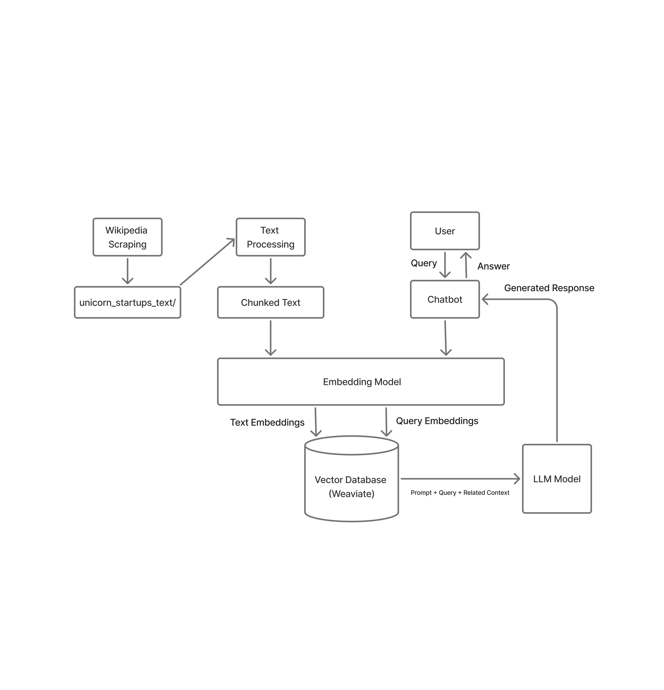
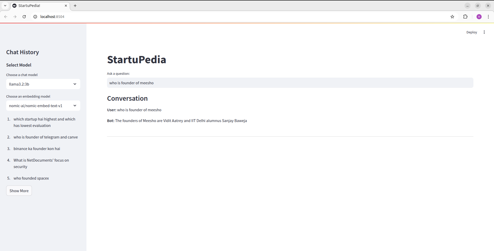

# Unicorn Startup Scraper and RAG Chatbot

**Project Overview**
This project involves scraping unicorn startup information from Wikipedia, extracting relevant details, storing the extracted data, embedding it into a vector database (Weaviate), and using a retrieval-augmented generation (RAG) pipeline with a chatbot for querying the stored information. Additionally, the chatbot responses are evaluated using various NLP metrics.
Project Components

**Project Architecture**
 

**1. Web Scraping**
  - **Purpose:**
  Scrape unicorn startup details from Wikipedia and extract company-specific pages for detailed text extraction.
  - **Technologies Used:**
     - Python 
     - requests 
     - BeautifulSoup 
     - os, re, time for data handling 
  - **Workflow:**
     - Fetch Wikipedia Page: Requests the Wikipedia page containing a list of unicorn startups. 
     - Extract Table Data: Identifies the correct table by searching for "Company" in headers. 
     - Extract Relevant Details: 
        - Name, Industry, Country, Valuation, Year Founded 
        - Extracts the Wikipedia page link for each startup (if available). 
     - Scrape Company-Specific Pages: 
        - Retrieves full-text content from company Wikipedia pages. 
        - Cleans text by removing unnecessary spaces and references. 
        - Saves each company's details in a separate .txt file.   
  - **Key Functions:**
     - get_unicorn_startups(): Extracts startup details from Wikipedia. 
     - scrape_startup_page(startup, index): Fetches and saves detailed company information. 
     - scrape_unicorns(): Starts the scraping process. 

**2. Data Processing & Embedding**
  - **Purpose:**
     - Split scraped text into chunks and store them as vector embeddings in Weaviate for efficient retrieval.
     - Technologies Used:
     - weaviate 
     - langchain.text_splitter 
     - sentence-transformers 
 - **Workflow:**
     - Load Text Files: Reads and processes scraped .txt files. 
     - Split Text into Chunks: Uses RecursiveCharacterTextSplitter to create meaningful data chunks. 
     - Embed Text Chunks: 
         - Uses SentenceTransformer to generate vector embeddings. 
         - Stores chunks in Weaviate. 
     - Store Data in Weaviate: Checks if a collection exists; if not, creates one and inserts data. 
  - **Key Functions:**
     - load_text_files(folder_path): Reads text files from the storage folder. 
     - split_text(text): Splits text into 1000-character chunks with 200-character overlap. 
     - insert_data(text_chunks): Embeds and stores text in Weaviate. 
     - setup_weaviate(): Ensures the correct Weaviate collection is created. 

**3. RAG Chatbot**
  - **Purpose:**
     - Query stored information using an LLM-powered chatbot with retrieval-augmented generation (RAG).
     - Technologies Used:
     - streamlit 
     - weaviate 
     - sentence-transformers 
     - ollama (for Llama 3) & Gemini
  - **Workflow:**
     - User Input: Receives a question from the Streamlit UI. 
     - Query Weaviate: Retrieves relevant text chunks using vector similarity search. 
     - Generate Response: 
         - Constructs a prompt with retrieved context. 
         - Queries Llama 3 via ollama.chat. 
         - Displays the chatbot's response. 
  - **Key Components:**
     - streamlit UI for chatbot interaction. 
     - model.encode(user_input): Converts the user query into an embedding. 
     - documents.query.near_vector(): Retrieves relevant text from Weaviate. 
     - ollama.chat(): Generates a response using Llama 3. 
  - **UI Screenshot:**
    

**4. Evaluation Pipeline**
  - **Purpose:**
     - Evaluate chatbot responses against a golden dataset using NLP metrics.
     - Technologies Used:
     - nltk (BLEU Score) 
     - rouge-score (ROUGE Score) 
     - sentence-transformers (Semantic Similarity) 
     - BERT_F1
     - F1 Score
     - METEOR
     - NLI SCORE
     - weaviate 
     - ollama 
  - **Workflow:**
     - Load Golden Dataset: JSON file containing expected Q&A pairs. 
     - Retrieve Relevant Context: Uses Weaviate to fetch related text chunks. 
     - Generate Chatbot Response: Queries Llama 3 or Gemini to answer based on retrieved context.   
     - Evaluate Metrics: 
        - BLEU Score: Measures word overlap between generated and expected answers. 
        - ROUGE Score: Compares text similarity based on recall and precision. 
        - Semantic Similarity: Computes cosine similarity between embeddings.   
        - Store Evaluation Results: Saves scores for later analysis. 
  - **Key Functions:**
     - evaluate_response(true_answer, chatbot_response, model): Computes BLEU, ROUGE, Semantic Similarity, BERT, F1, NLI, METEOR. 
     - compute_semantic_similarity(model, expected, generated): Measures similarity between expected and generated responses. 
     - compute_embedding(model, text): Encodes text into an embedding. 
     - compute_nli(self, premise, hypothesis): Measures confidence score i.e Entailment, Neutral, Contradiction between expected and generated answers

**Conclusion**
This project successfully integrates web scraping, vector search, and LLM-based chatbot functionalities to provide an interactive knowledge retrieval system. By leveraging Weaviate for efficient storage and retrieval, along with an evaluation pipeline, the system ensures high-quality responses with measurable accuracy.
